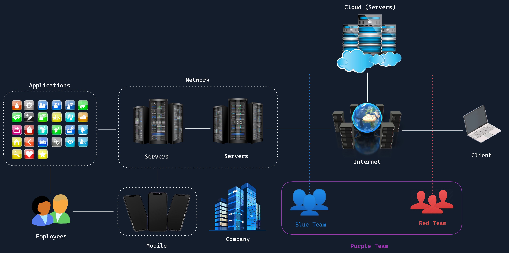

# Structure of Information Security (InfoSec)

## Introducción

Este módulo introduce los fundamentos de **Information Security (InfoSec)**, explicando cómo está estructurada, cuáles son sus áreas principales, los roles dentro de la ciberseguridad y las oportunidades profesionales disponibles.

Está dirigido a **personas que comienzan desde cero en ciberseguridad**, proporcionando una visión general que permita entender el ecosistema de seguridad informática y decidir en qué área especializarse.

Antes de realizar ejercicios prácticos, es necesario comprender los conceptos teóricos que forman la base de este campo.

---

# ¿Qué es Information Security?

La **Seguridad de la Información (InfoSec)** se enfoca en proteger la información y los sistemas digitales contra accesos no autorizados, modificaciones o destrucción de datos.

Hoy en día dependemos de plataformas digitales para:

- Comunicarnos
- Realizar operaciones bancarias
- Comprar online
- Gestionar empresas

Por esta razón, **proteger los datos es esencial**.

Los principales objetivos de InfoSec son proteger:

- **Confidencialidad**: que solo las personas autorizadas accedan a la información.
- **Integridad**: que los datos no sean modificados sin autorización.
- **Disponibilidad**: que los sistemas y datos estén accesibles cuando se necesiten.

---

# Estructura Básica del Mundo Digital

  

Los sistemas digitales están compuestos por varios elementos interconectados:

### Client
Computadora o dispositivo desde donde el usuario accede a recursos y servicios en Internet.

### Internet
Red global que conecta servidores y servicios.

### Servers
Máquinas que ofrecen servicios específicos como:

- páginas web
- aplicaciones
- bases de datos

### Network
Conjunto de dispositivos conectados que pueden comunicarse entre sí.

### Cloud
Centros de datos con servidores interconectados que ofrecen servicios a empresas y usuarios.

---

# Equipos de Ciberseguridad

Dentro de las organizaciones existen diferentes equipos de seguridad:

### Blue Team
Responsable de la **defensa interna** de la organización.

Funciones:
- monitoreo de sistemas
- detección de ataques
- protección de infraestructura

### Red Team
Simula **ataques reales** contra la organización para identificar vulnerabilidades.

### Purple Team
Combina **Red Team + Blue Team**, trabajando juntos para mejorar la seguridad.

---

# Penetration Testing

Un **Penetration Tester** es un profesional que:

- simula ataques contra sistemas
- identifica vulnerabilidades
- ayuda a corregir debilidades de seguridad

El objetivo es **descubrir fallos antes que los atacantes reales**.

---

# Transformación Digital y Riesgos

Cada vez más servicios se trasladan a internet en un proceso llamado **Digital Transformation**.

Esto trae ventajas:

- mayor eficiencia
- acceso remoto
- automatización

Pero también aumenta:

- la superficie de ataque
- las oportunidades para ciberdelincuentes

Los ataques pueden provocar:

- pérdidas financieras
- daño a la reputación
- pérdida de confianza de clientes
- problemas legales

---

# Analogía del Castillo

La seguridad informática puede compararse con un **castillo que protege un tesoro**.

| Elemento | Significado |
|--------|--------|
| Tesoro | Información valiosa |
| Murallas | Firewalls y mecanismos de defensa |
| Guardias | Controles de acceso y monitoreo |
| Caballeros | Penetration testers que prueban la seguridad |
| Ladrones | Ciberdelincuentes |
| Expansión del castillo | Transformación digital |

---

# Áreas de Information Security

InfoSec es un campo amplio con múltiples especializaciones:

- **Network Security** – protección de redes
- **Application Security** – seguridad del software
- **Operational Security** – gestión segura de procesos
- **Disaster Recovery & Business Continuity** – recuperación ante desastres
- **Cloud Security** – seguridad en servicios cloud
- **Physical Security** – protección física de infraestructura
- **Mobile Security** – seguridad en dispositivos móviles
- **IoT Security** – seguridad de dispositivos conectados

---

# Conceptos Fundamentales de Seguridad

## Risk (Riesgo)

Probabilidad de que ocurra un evento que cause daño a la organización.

Se evalúa considerando:

- probabilidad
- impacto

---

## Threat (Amenaza)

Posible causa de un incidente de seguridad.

Puede ser:

- hackers
- malware
- empleados maliciosos
- desastres naturales

---

## Vulnerability (Vulnerabilidad)

Debilidad en un sistema que puede ser explotada por una amenaza.

Ejemplos:

- errores de software
- configuraciones incorrectas
- contraseñas débiles

---

### Relación entre los tres conceptos
