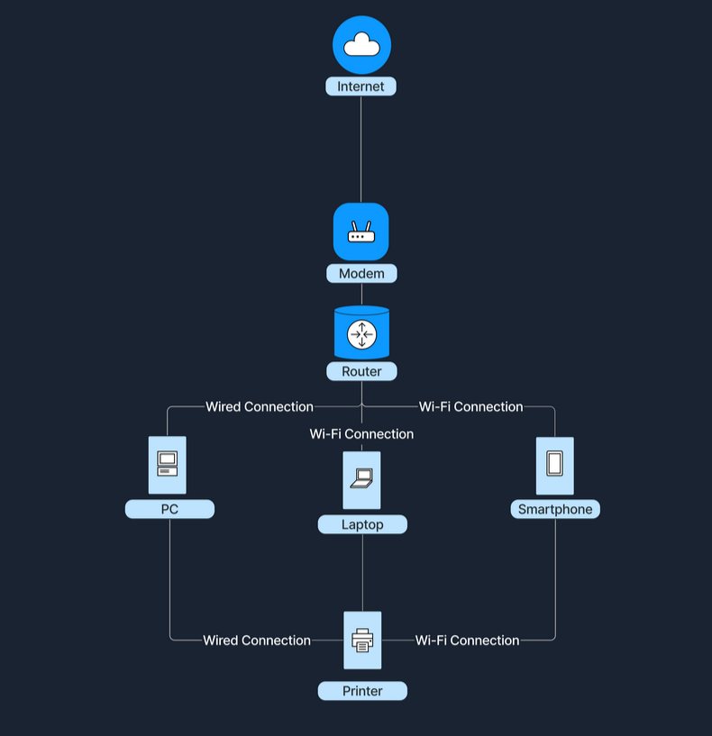
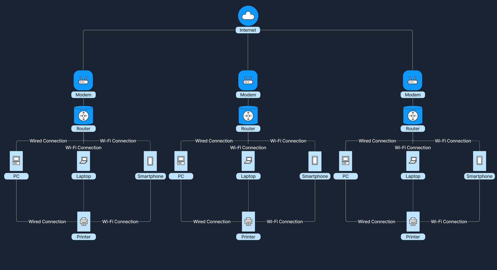

# 🌐 Introduction to Networks

## 📌 ¿Qué es una red?

Una red es un conjunto de dispositivos interconectados que pueden comunicarse entre sí y compartir información.

- **Nodos:** dispositivos como PC, laptop, smartphone, impresora  
- **Enlaces:** conexiones (cableadas o Wi-Fi)  
- **Objetivo:** compartir datos y recursos  

---

## 🌍 ¿Por qué son importantes?

Las redes permiten:

- Compartir recursos (impresoras, archivos)  
- Comunicación (emails, chats, videollamadas)  
- Acceso a información desde cualquier lugar  
- Trabajo colaborativo en tiempo real  

---

## 🏠 LAN (Local Area Network)

Una **LAN** conecta dispositivos en un área pequeña (hogar, escuela, oficina).

- Alta velocidad  
- Bajo costo  
- Administración local  

### 📷 Ejemplo de LAN

---

## 🌐 WAN (Wide Area Network)

Una **WAN** conecta múltiples redes LAN en grandes distancias.

- Cubre ciudades o países  
- Más compleja  
- Ejemplo: Internet  

### 📷 Ejemplo de WAN

---

## ⚖️ Diferencias LAN vs WAN

| Característica | LAN | WAN |
|--------------|-----|-----|
| Tamaño | Pequeño | Grande |
| Velocidad | Alta | Menor |
| Propiedad | Privada | Compartida |
| Costo | Bajo | Alto |

---

## 🔗 ¿Cómo trabajan juntas?

Una LAN se conecta a una WAN (Internet) mediante:

- **Modem:** conecta con el proveedor de internet  
- **Router:** distribuye la conexión a los dispositivos  

👉 **Ejemplo:**  
Casa (LAN) → Router → Modem → Internet (WAN)
